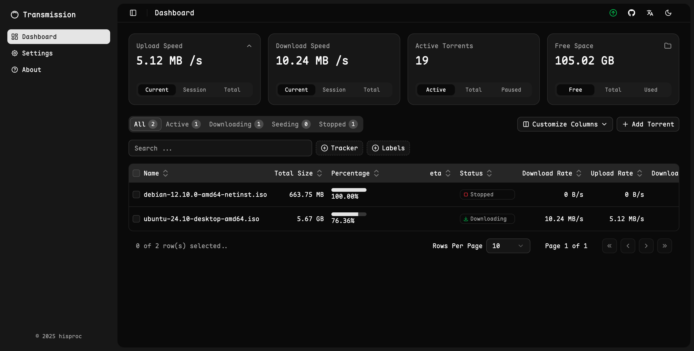

<h1 align="center" style="border-bottom: none;"> Transmission Next UI</h1>
<h3 align="center"> A third-party modern web-based frontend for Transmission, offering a sleek and responsive UI for managing your torrents with ease, built using shadcn/ui and Vite. </h3>

---

English | [简体中文](README.md)

## Preview





## Features

- Modern UI Design
- Responsive Layout, Perfect for All Devices
- Fast Loading Experience with Next.js
- [x] Torrent Management and Information Viewing
- [x] Configuration Settings
- [x] Drag-and-Drop/Paste to Add Torrents
- [x] Dark Mode Support
- [x] Tracker Filter
- [x] Torrent Label Support
- [x] Batch Replace Trackers

⚠️**Notice**: This is an early version of the project. It has not been fully tested yet. Please verify its functionality before using it in production.

## Quick Start

You can deploy Transmission Next UI in three different ways:

### 1. Easy Install

> Requires: `docker`, `docker-compose`, and `curl`

To install web UI or upgrade to the latest version, run the following command:

```bash
curl -fsSL https://raw.githubusercontent.com/hisproc/transmission-next-ui/main/download.sh | bash
```

This will download the latest release and create a `docker-compose.yml` file in your current directory.

You can now modify the `docker-compose.yml` file to set your own **Transmission username**, **password**, and **timezone**:

```yaml
environment:
  - USER=your-username
  - PASS=your-password
  - TZ=Asia/Shanghai
```

Then use the following commands to start or stop the service:

```bash
docker-compose up -d   # start in background
docker-compose down    # stop and remove the container
```

By default, the container runs using `network_mode: host` for better connectivity, which is ideal for Linux environments. If you are on **macOS**, `host` mode is not supported — you will need to manually switch to **port mapping** (e.g., `9091:9091`) in the `docker-compose.yml` file. You can adjust this behavior in the `docker-compose.yml` according to your network setup.

### 2. Manual Install

1. Go to the [Releases](https://github.com/hisproc/transmission-next-ui/releases) page
2. Download the latest or stable release (e.g. `transmission-next-ui-v1.0.0.zip`)
3. Extract it and copy the contents to your transmission web directory (e.g. transmission/web/src)


### 3. Build from Source

```bash
git clone git@github.com:hisproc/transmission-next-ui.git
cd transmission-next-ui
npm install
npm run build
```

Then, copy the contents of the `dist/` folder to your transmission web directory.

## License

This project is licensed under the [MIT License](LICENSE).
