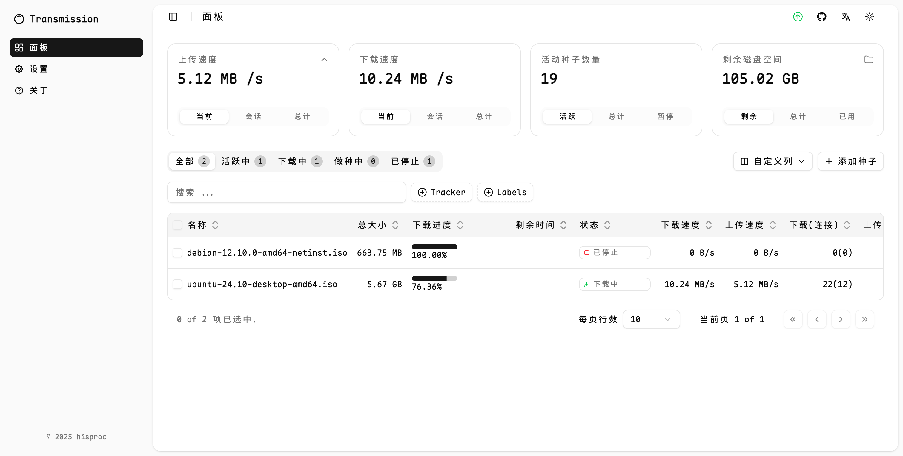
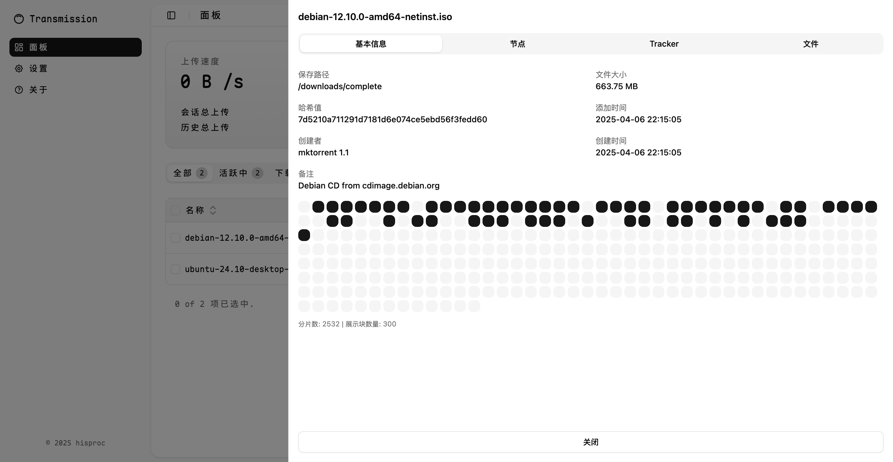

# Transmission Next UI

[English](README.md) | 简体中文

一个[Transmission](https://github.com/transmission/transmission)的第三方Web UI，使用shadcn/ui和Vite构建。

## 预览




## 功能

- 现代化 UI 设计
- 响应式布局，适配所有设备
- [x] 种子管理，信息查看
- [x] 配置设置
- [x] 拖拽/粘贴添加种子

⚠️本项目为早期版本，尚未经过完整测试，正式使用前请自行验证其功能是否符合预期。

## 快速开始

可以通过三种方式部署 Transmission Next UI：

### 1. 一键安装

> 依赖环境：`docker`、`docker-compose` 和 `curl`

初次安装或升级到最新版本，运行以下命令：

```bash
curl -fsSL https://raw.githubusercontent.com/hisproc/transmission-next-ui/main/download.sh | bash
```

执行后将在当前目录生成一个 `docker-compose.yml` 文件。

编辑该文件来自定义 Transmission 的用户名、密码和时区：

```yaml
environment:
  - USER=your-username
  - PASS=your-password
  - TZ=Asia/Shanghai
```

然后通过以下命令启动或停止服务：

```bash
docker-compose up -d   # 后台启动
docker-compose down    # 停止并移除容器
```

默认情况下容器使用 `network_mode: host` 网络模式，更适合 Linux 系统。  
**注意：** macOS 不支持 `host` 网络模式，此时请手动改为端口映射（如 `9091:9091`），并在 `docker-compose.yml` 中进行相应修改。

### 2. 手动安装

1. 打开 [Releases](https://github.com/hisproc/transmission-next-ui/releases) 页面
2. 下载最新或稳定版本（如 `transmission-next-ui-v1.0.0.zip`）
3. 解压并将其中的内容复制到 Transmission 的 Web 目录（如 `transmission/web/src`）

Tips: 如果使用群辉套件，流程可参考[解决群晖DSM7.0安装Transmission与汉化UI问题](https://post.smzdm.com/p/apxwp352/)

### 3. 源代码打包

```bash
git clone git@github.com:hisproc/transmission-next-ui.git
cd transmission-next-ui
npm install
npm run build
```

构建完成后，将 `dist/` 目录下的所有内容复制到 Transmission 的 Web 目录下即可。

## 许可证

本项目采用 [MIT 许可证](LICENSE) 进行授权。
