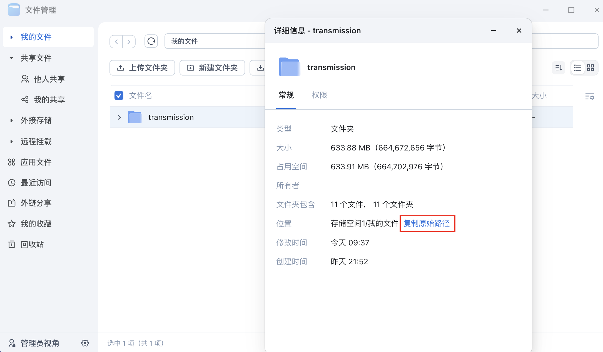
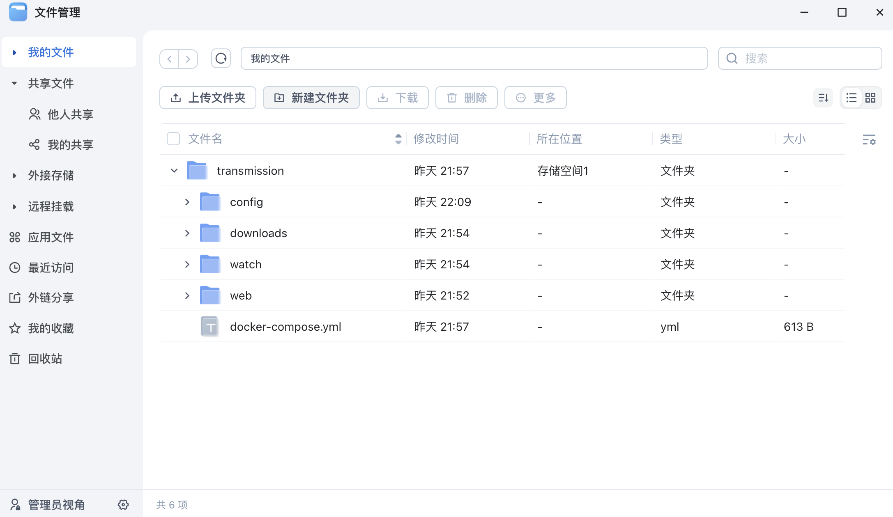
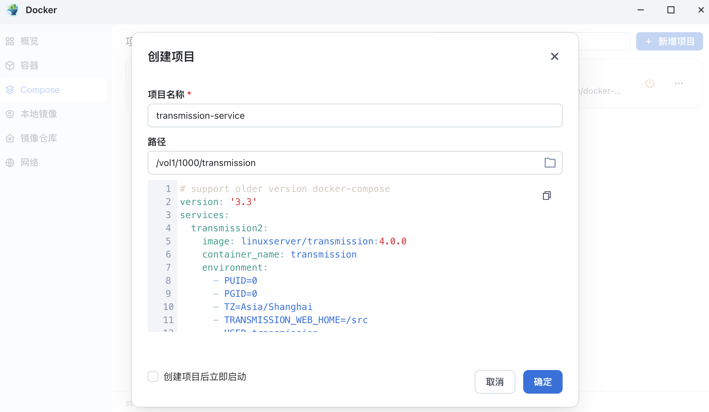

## 群辉

使用**群辉**套件，可参考以下脚本，其中使用的套件来源为矿神群晖SPK，首先从[Release](https://github.com/hisproc/transmission-next-ui/releases)下载最新版本的压缩包`release.zip`，并下载[synology.sh](scripts/synology.sh)脚本到同一目录下，执行以下命令，脚本将自动解压并尝试解压到目标路径:

```bash
chmod +x synology.sh
sudo bash synology.sh
```

输出 `Deployment complete` 即表示安装完成，旧的web目录内容会备份到当前执行目录下，文件为`backup.zip`，如果需要恢复到安装前的状态，请重命名`backup.zip`为`release.zip`，并重新执行上述命令。

更新时只需要再次执行脚本即可。

## 飞牛OS

飞牛OS自带了Docker环境，首先确定你要安装的路径，例如先创建一个文件夹，这里以transmission为例，获取文件夹的路径，通过SSH登入飞牛OS，执行脚本:



```bash
cd /vol1/1000/transmission # 此处替换为你要安装的路径
sudo curl -fsSL https://raw.githubusercontent.com/hisproc/transmission-next-ui/main/download.sh | bash
```

执行后将在当前目录如下结构:



最后使用飞牛自带的Docker compose服务启动即可，默认用户名密码为`transmission:transmission`，可以直接在窗口下方的配置中修改:



启动后访问`http://IP:9091`即可访问。更新时只需要在transmission目录下重新执行一次脚本即可，无需重启docker-compose服务。